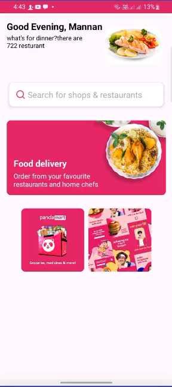
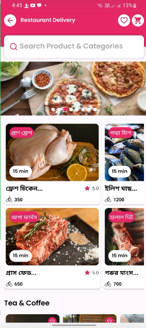
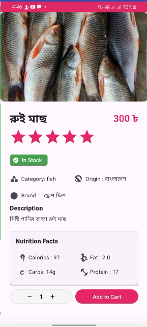
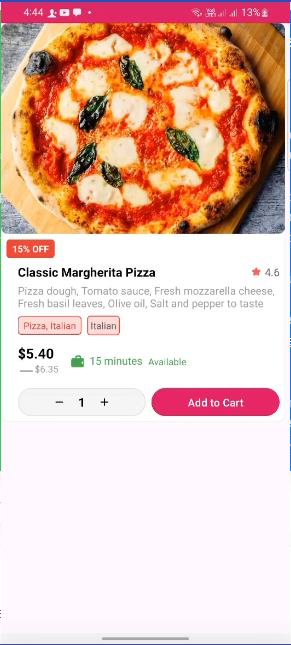
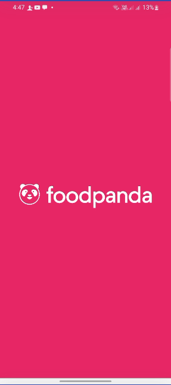

# FoodOderApps 🍔🍕🍣

> A simple and user-friendly Android app for food ordering and delivery.

---

## 🚀 Project Overview

FoodOderApps is an Android application designed to let users browse restaurants, view menus, place orders, and track deliveries — all in one seamless app experience. This project is built with modern Android development tools and best practices.

---

## 📸 Screenshots

### Home Screen


### Menu Screen


### Category Tracking


### Pizza Details



### Splesh Screen



### Fish Order Details


---

## 🔧 Features

- Browse nearby restaurants and their menus
- Add items to cart and place orders
- Real-time order tracking
- User-friendly interface with smooth navigation
- Offline caching for menus

---

## 🛠️ Tech Stack

- **Language:** Java (Specify which one you used)
- **IDE:** Android Studio
- **Version Control:** Git & GitHub
- **Libraries:** Volley, Glide, RoundedImageView..
- **Others:** RecyclerView, OOP principles, Model classes, Constructors, Getters & Setters
-  **API:** RESTful API (Specify if you have any backend)

---

## ⚙️ Installation & Setup

1. Clone the repository:

   ```bash
   git clone https://github.com/MdMannanHosen/Food-Flash.git
2. Open the project in Android Studio.

3. Build and run the app on your emulator or physical device.

   
 🤝 Contribution
Feel free to fork the repository, make changes, and submit pull requests! Issues and suggestions are welcome.

📄 License
This project is licensed under the MIT License - see the LICENSE file for details.

📞 Contact
Md Mannan Hosen
Email: mdmannanhosen632840@gmail.com
GitHub: MdMannanHosen
LinkedIn: www.linkedin.com/in/mdmannanhosen


✨ Thank you for checking out FoodOderApps! ✨

   
